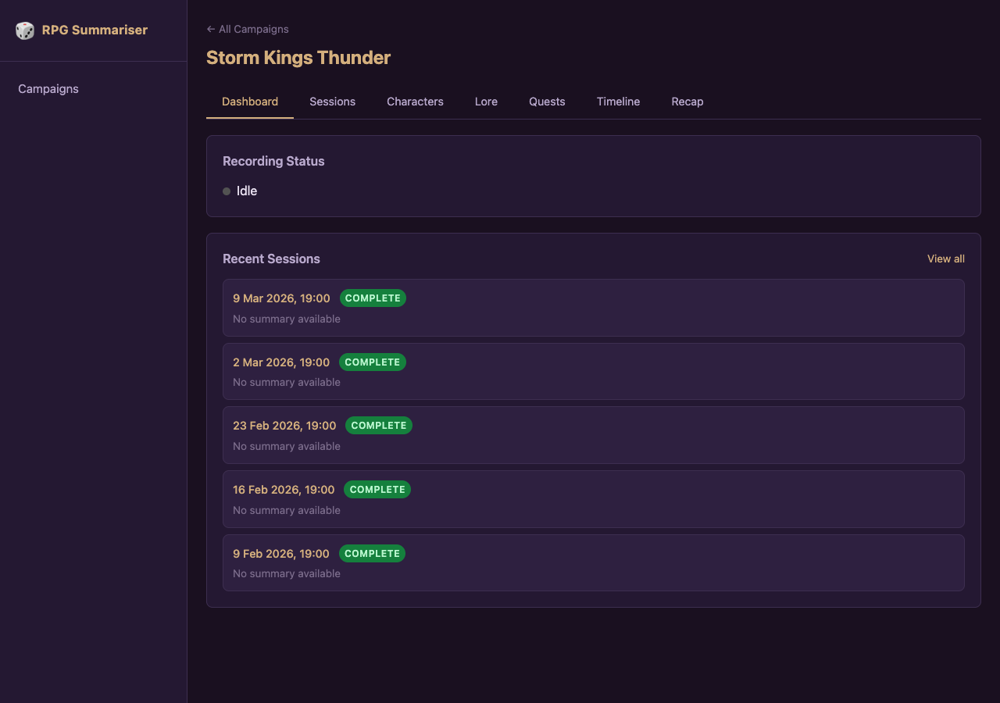
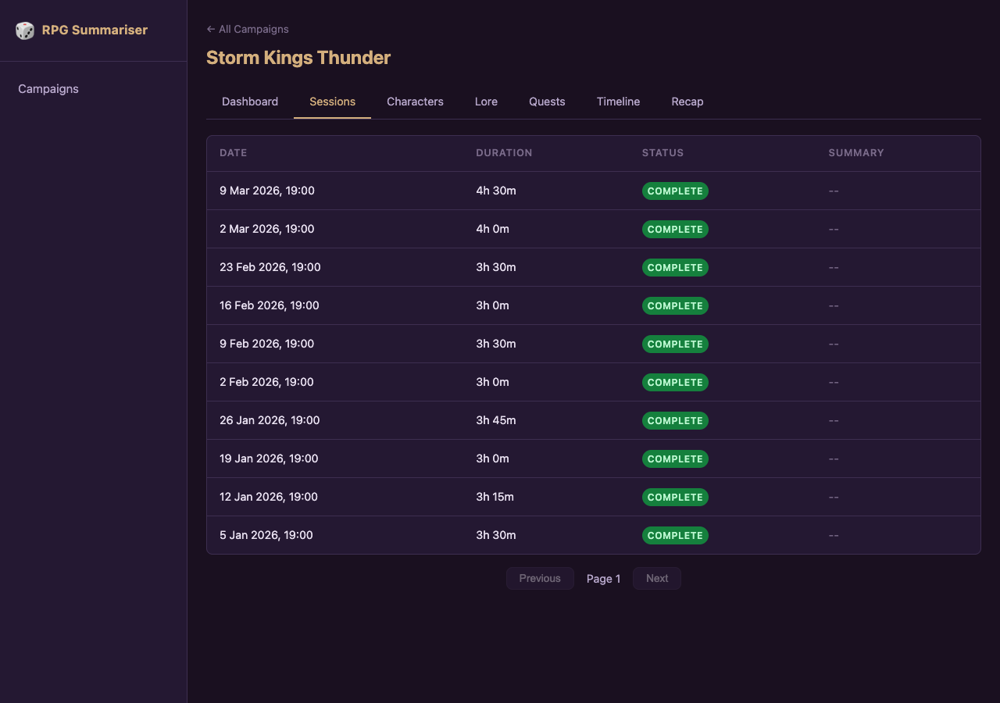
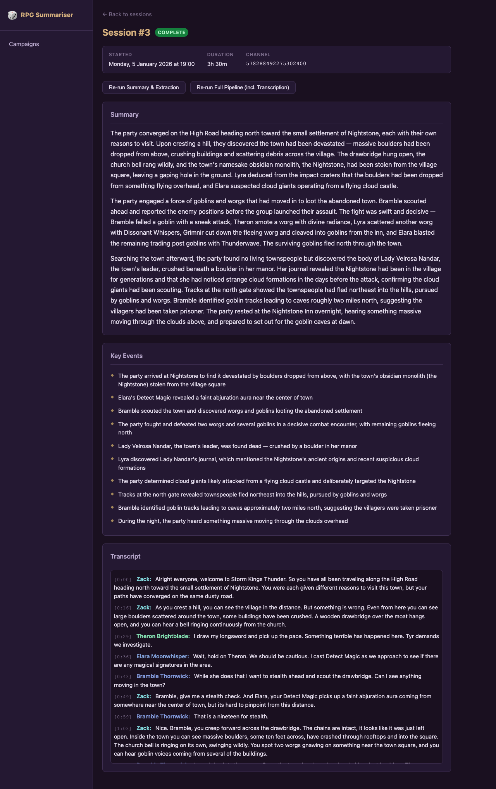
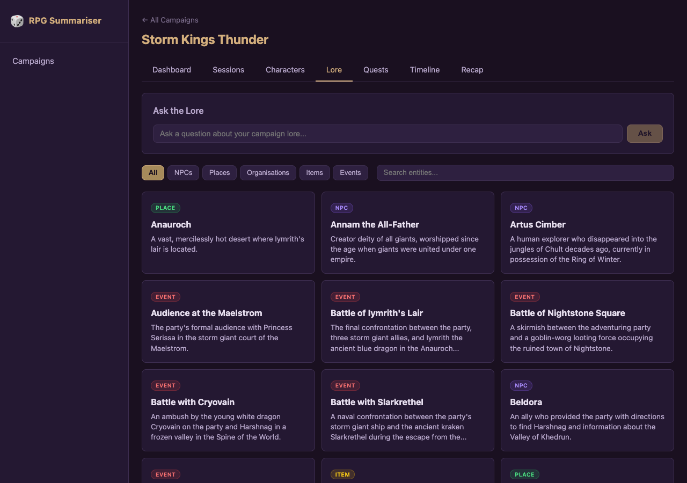
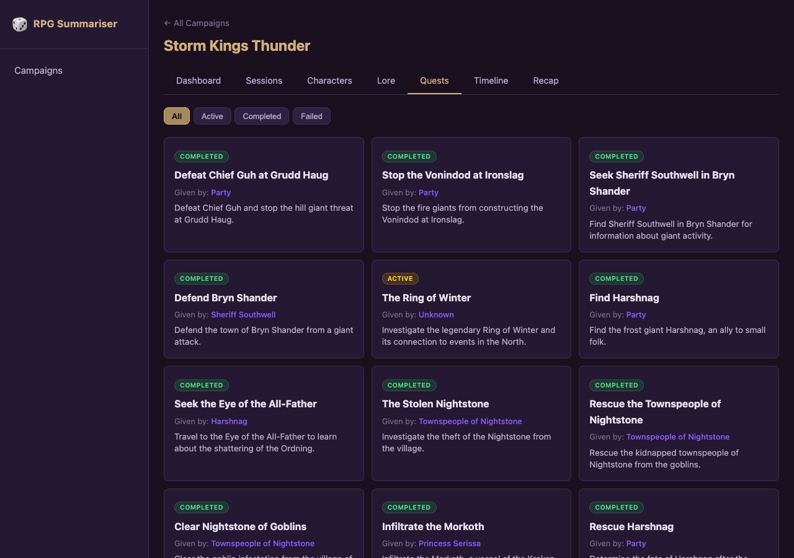
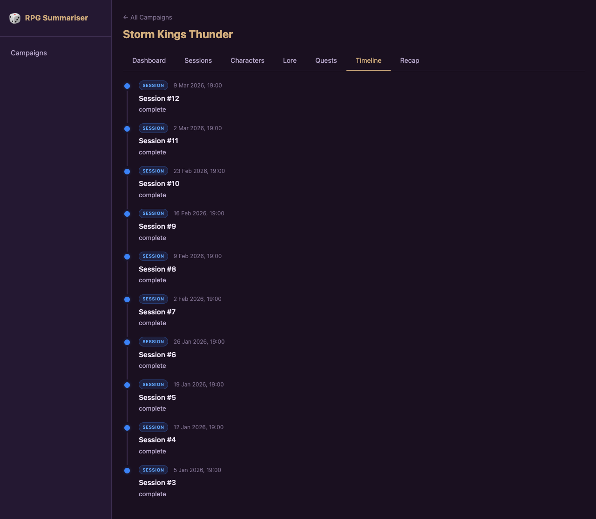

# Discord RPG Session Summariser

A Discord bot that records D&D voice sessions, transcribes them with whisper.cpp, and generates structured summaries, entity extraction, and quest tracking using LLMs. Includes a web panel for browsing campaigns, sessions, lore, and more.

## Features

- **Voice Recording** — Records per-user audio from Discord voice channels with DAVE E2EE decryption
- **Live Transcription** — Sliding-window transcription streamed to the web panel in real time
- **Session Summaries** — LLM-generated narrative summaries with key events
- **Knowledge Base** — Automatic extraction of NPCs, places, items, organisations, and events with status tracking (alive/dead) and location hierarchy
- **Quest Tracker** — Quests are extracted from sessions and tracked across the campaign
- **Combat Encounters** — Automatic detection and extraction of combat encounters from sessions
- **Campaign Timeline** — Unified chronological view of sessions, entities, and quest milestones
- **Entity Timeline** — Swimlane chart visualising entity involvement across sessions
- **Campaign Stats** — Dashboard with Chart.js visualisations of session metrics
- **Relationship Graph** — Interactive D3.js force graph showing entity relationships
- **PDF Campaign Book** — Export your campaign as a D&D-style PDF book
- **Lore Q&A** — RAG-powered semantic search using pgvector embeddings
- **Story Recap** — Generate a narrative recap of your entire campaign
- **Transcript Search** — Full-text search across all session transcripts
- **Audio Playback** — Play session recordings with synchronised transcript highlighting
- **Discord OAuth2** — Optional authentication for the web panel via Discord login
- **Telegram Integration** — Capture DM text messages from a Telegram group chat during sessions
- **Web Panel** — Dark-themed D&D UI for browsing all campaign data

## Demo

*Storm King's Thunder campaign with 10 sessions of generated transcript, summary, entity, and quest data.*

[demo.webm](https://github.com/user-attachments/assets/c33b9975-9666-4144-bb24-a3b6519a520d)

<details>
<summary>Screenshots</summary>

#### Campaign Dashboard


#### Sessions List


#### Session Transcript


#### Knowledge Base


#### Quest Tracker


#### Campaign Timeline


</details>

## Architecture

- **Go** backend with CGO bindings to whisper.cpp and opus
- **SvelteKit** frontend (static adapter, served by the Go server)
- **PostgreSQL** with pgvector for storage and semantic search
- **Claude CLI** or **Ollama** for LLM summarisation and extraction

## Prerequisites

- Go 1.23+
- Node.js 22+
- PostgreSQL 17+
- CMake and a C/C++ compiler (for whisper.cpp)
- `libopus-dev` (for opus audio decoding)
- `claude` CLI installed (if using Claude for summarisation), or Ollama running locally

## Quick Start

### 1. Clone the repository

```bash
git clone https://github.com/zackpollard/discord-rpg-summariser.git
cd discord-rpg-summariser
```

### 2. Create a Discord bot

1. Go to the [Discord Developer Portal](https://discord.com/developers/applications)
2. Create a new application
3. Go to **Bot** and create a bot — copy the token
4. Enable these **Privileged Gateway Intents**: Server Members Intent, Message Content Intent
5. Go to **OAuth2 > URL Generator**, select scopes `bot` and `applications.commands`
6. Select permissions: Connect, Speak, Use Voice Activity, Send Messages, Use Slash Commands
7. Use the generated URL to invite the bot to your server

### 3. Configure

```bash
cp config.example.yaml config.yaml
```

Edit `config.yaml` with your Discord bot token and guild ID. You can find the guild ID by enabling Developer Mode in Discord and right-clicking your server.

### 4. Start development

```bash
make dev
```

This starts PostgreSQL via Docker, builds whisper.cpp, and runs the Go backend and Svelte dev server. The web panel is available at `http://localhost:5173` (proxied to the API on `:8080`).

### 5. Set up your campaign

In Discord:
```
/campaign create name:My Campaign
/campaign dm                        # sets you as the DM
/character set name:Thorin           # set your character name
```

### 6. Record a session

```
/session start    # bot joins your voice channel
/session stop     # stops recording and begins processing
```

The bot will transcribe the audio, generate a summary, extract entities and quests, and post a notification in Discord.

## Shared Microphone Support

If two people share a microphone, the bot can use speaker diarization to separate their voices and attribute transcript segments correctly. Any two people can share a mic — neither needs to be the DM.

Uses [sherpa-onnx](https://github.com/k2-fsa/sherpa-onnx) (pyannote segmentation + speaker embeddings) for diarization. Models are downloaded automatically on first use (~40MB total).

### Setup

Configure the shared mic — the partner can be a Discord user or a named non-Discord person:
```
/campaign shared-mic user:@Alice partner:@Bob
/campaign shared-mic user:@Alice partner-name:Gandalf
```

To remove: `/campaign shared-mic user:@Alice` (with no partner options).

### Voice Enrollment

The bot automatically enrols each user's voice print during regular sessions. For shared-mic users who never record solo, use the explicit enrol command:
```
/campaign enroll                            # enrol yourself
/campaign enroll user:@Alice                # enrol Alice
/campaign enroll user:@Alice partner:true   # enrol Alice's shared-mic partner
                                            # (only the partner should speak)
```

The bot joins voice, records a 10-second sample, extracts a speaker embedding, and saves it for the campaign. Future shared-mic sessions use these voice prints to identify who is speaking instead of falling back to a speaking-time heuristic.

### Transcription Engine

Two speech-to-text engines are supported:

| Engine | Config | Description |
|--------|--------|-------------|
| `whisper` | `engine: "whisper"` | Default. whisper.cpp with selectable model size. |
| `parakeet` | `engine: "parakeet"` | NVIDIA Parakeet TDT 0.6B v3. Faster on CPU, better quality, 25 European languages. ~465MB model auto-downloaded on first use. |

## Docker Deployment

### Build and run with Docker Compose

```bash
cp config.example.yaml config.yaml
# Edit config.yaml with your settings, then:
docker compose -f docker-compose.prod.yml up -d
# Copy your config into the data volume:
docker compose -f docker-compose.prod.yml cp config.yaml bot:/data/config.yaml
```

The bot stores all runtime data (config, audio recordings, models) under `/data` in the container. The production compose file uses a single `botdata` volume for this. The web panel will be available at `http://localhost:8080`.

### Use the pre-built image

Pre-built images are published to GHCR on every release via [release-please](https://github.com/googleapis/release-please). Images are tagged with the semver version (e.g., `0.2.0`, `0.2`) and `latest`.

```bash
docker pull ghcr.io/zackpollard/discord-rpg-summariser:latest
```

Or pin to a specific version in `docker-compose.prod.yml`.

## Configuration

All configuration is in `config.yaml`. Environment variables override config file values:

| Environment Variable | Config Path | Description |
|---------------------|-------------|-------------|
| `DISCORD_TOKEN` | `discord.token` | Discord bot token |
| `DISCORD_GUILD_ID` | `discord.guild_id` | Discord server ID |
| `DISCORD_CLIENT_ID` | `discord.client_id` | Discord OAuth2 client ID (optional, for web auth) |
| `DISCORD_CLIENT_SECRET` | `discord.client_secret` | Discord OAuth2 client secret (optional, for web auth) |
| `DATABASE_URL` | `storage.database_url` | PostgreSQL connection string |
| `WEB_SESSION_SECRET` | `web.session_secret` | Cookie encryption secret (auto-generated if empty) |
| `TELEGRAM_BOT_TOKEN` | `telegram.bot_token` | Telegram bot token (optional) |

### LLM Provider

**Claude CLI** (default): Install the [Claude CLI](https://docs.anthropic.com/en/docs/claude-code) and ensure `claude --print` works.

**Ollama**: Set `llm.provider: ollama` and configure `ollama_url` and `ollama_model` in config.yaml.

### Whisper Model

The `transcribe.model` setting controls transcription quality vs speed:

| Model | Size | Speed | Quality |
|-------|------|-------|---------|
| `tiny` | 75 MB | Fastest | Low |
| `base` | 142 MB | Fast | Medium |
| `small` | 466 MB | Moderate | Good |
| `medium` | 1.5 GB | Slow | High |
| `large-v3` | 3.1 GB | Slowest | Best |

Models are downloaded automatically on first use.

## Telegram Integration

Optionally capture text messages from a Telegram group chat during sessions. This is useful when the DM pastes lore, NPC dialogue, or item descriptions into a shared chat while reading them aloud.

### Setup

1. Create a Telegram bot via [@BotFather](https://t.me/BotFather)
2. Disable privacy mode: send `/setprivacy` to BotFather, select your bot, choose **Disable**
3. Add the bot to your D&D group chat
4. Get your chat ID (send a message in the group, then check `https://api.telegram.org/bot<TOKEN>/getUpdates`)
5. Add to `config.yaml`:
   ```yaml
   telegram:
     bot_token: "your-bot-token"
     chat_id: -1001234567890
   ```
6. In Discord, set the DM's Telegram user ID:
   ```
   /campaign telegram-dm telegram_user_id:123456789
   ```

Telegram messages from the DM are filtered for relevance (short chatter is excluded), interleaved with the voice transcript by timestamp, and marked as `[DM via Telegram]` in the transcript. The LLM is instructed to treat these as authoritative text.

## Discord Commands

| Command | Description |
|---------|-------------|
| `/session start` | Start recording in your voice channel |
| `/session stop` | Stop recording and process |
| `/session status` | Show current session info |
| `/campaign create` | Create a new campaign |
| `/campaign list` | List all campaigns |
| `/campaign set` | Set the active campaign |
| `/campaign dm` | Set the Dungeon Master |
| `/campaign shared-mic` | Configure a shared microphone (two speakers) |
| `/campaign enroll` | Record a voice sample for speaker identification |
| `/campaign telegram-dm` | Set the DM's Telegram user ID |
| `/campaign recap` | Generate or view the story recap |
| `/character set` | Set a character name mapping |
| `/character list` | List character mappings |
| `/character remove` | Remove a character mapping |
| `/quest list` | List campaign quests |
| `/quest complete` | Mark a quest as completed |
| `/quest fail` | Mark a quest as failed |

## Development

```bash
make help           # show all targets
make dev            # start everything for development
make build          # build Go binary and Svelte app
make test           # run all tests
make test-unit      # run unit tests only
make test-web       # run frontend tests only
make lint           # run Go vet and Svelte check
```

## Project Structure

```
cmd/bot/              Go entrypoint
internal/
  api/                HTTP API handlers
  auth/               Discord OAuth2 authentication and session management
  audio/              Audio utilities (mixing, resampling)
  bot/                Discord bot, command handlers, pipeline
  config/             Configuration loading
  diarize/            Speaker diarization (sherpa-onnx)
  embed/              Vector embeddings (Ollama) for RAG semantic search
  pdf/                D&D-style PDF campaign book generation
  storage/            PostgreSQL storage layer
  summarise/          LLM prompts and clients (Claude CLI, Ollama)
  telegram/           Telegram Bot API client
  transcribe/         Whisper.cpp bindings and transcript merging
  voice/              Discord voice recording, DAVE decryption, live transcription
web/                  SvelteKit frontend
migrations/           PostgreSQL schema migrations
_deps/                Vendored dependencies (discordgo fork, whisper.cpp)
```
